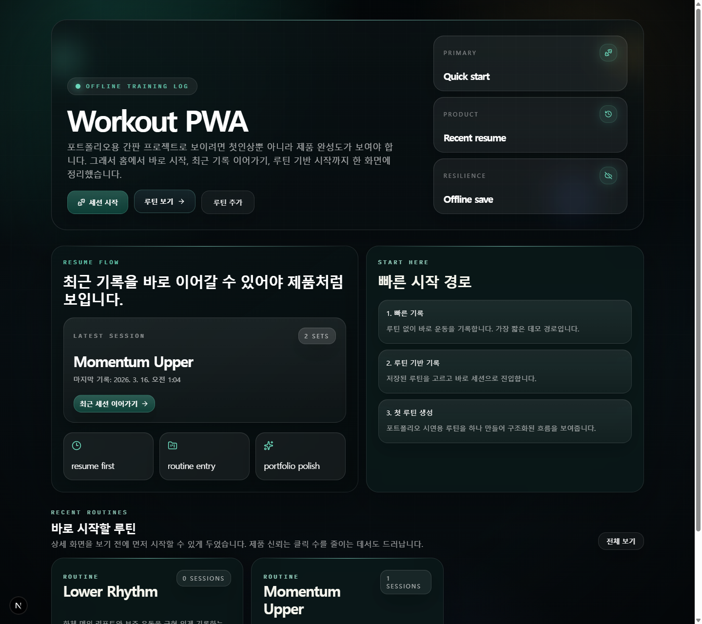
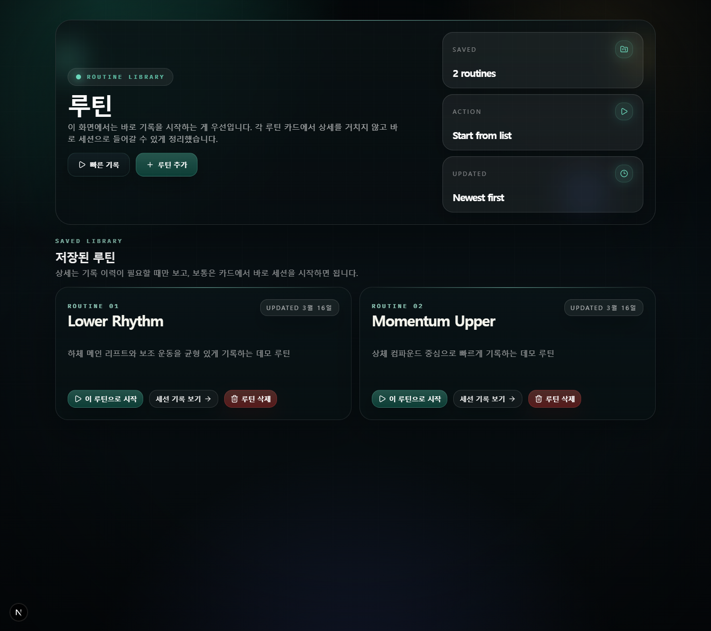
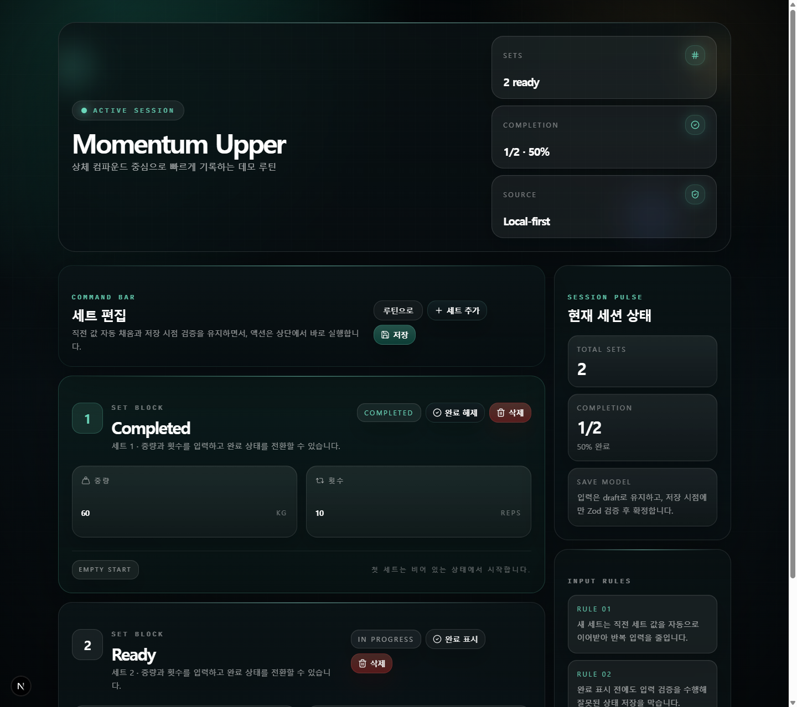

# Workout PWA

로컬 저장을 기본으로 삼은 운동 기록 PWA입니다.  
핵심 목표는 네트워크가 불안정해도 기록 흐름이 끊기지 않는 것, 그리고 포트폴리오에서 제품 완성도가 바로 보이도록 만드는 것입니다.

현재 버전은 기능 중심 MVP에서 한 단계 더 나아가, `빠른 진입`, `최근 세션 재개`, `루틴 기반 시작`, `전술 HUD 톤의 세션 에디터`까지 제품 경험 전체를 다시 정리했습니다.

## Latest UI (2026-03-16)







추가 캡쳐:

- [Routine Detail Edit](./docs/evidence/2026-03-16/03-routine-detail-edit.png)
- [Routine Builder](./docs/evidence/2026-03-16/05-routine-builder.png)
- [Validation Error](./docs/evidence/2026-03-16/06-validation-error.png)

## Product Highlights

- 홈에서 `세션 시작`, `최근 세션 이어가기`, `루틴 보기`를 한 화면에 배치해 첫 진입 흐름을 짧게 만들었습니다.
- 루틴 목록에서 상세를 거치지 않고 바로 세션을 시작할 수 있습니다.
- 세션 화면은 단순 폼이 아니라, 상태 요약과 입력 규칙을 함께 보여주는 `session console` 형태로 재구성했습니다.
- 전체 UI는 어두운 유리 패널과 네온 포인트를 사용하는 `tactical glass` 무드로 정리했습니다.

## Core Design Decisions

### 1. Draft와 Saved State 분리

- 입력 중 상태는 `draftBySetId`로 관리합니다.
- 저장 시점에만 Zod 검증 후 Zustand store와 IndexedDB에 반영합니다.
- 덕분에 입력 UX와 저장 데이터 무결성을 분리해서 다룰 수 있습니다.

### 2. Runtime Validation

- TypeScript는 컴파일 시점 안전성만 보장합니다.
- 실제 사용자 입력은 런타임 데이터이므로 Zod로 최종 검증합니다.
- `z.coerce.number()`를 사용해 숫자 입력을 안전하게 변환한 뒤 추가 조건을 적용합니다.

### 3. Local-first Persistence

- 세션과 루틴은 IndexedDB(Dexie)에 저장합니다.
- 네트워크와 무관하게 기록, 새로고침 복구, 재진입 복구가 가능합니다.
- 선택적으로 outbox sync를 활성화해 서버 백업 계층을 붙일 수 있습니다.

### 4. Repeated Input Reduction

- 새 세트는 직전 세트 값을 기본값으로 이어받습니다.
- 반복 입력량을 줄여 실제 운동 상황에 맞는 기록 흐름을 만들었습니다.

## Demo Scenario

1. 홈에서 `세션 시작` 또는 `최근 세션 이어가기`를 선택합니다.
2. 루틴이 있다면 `/routines`에서 원하는 루틴 카드의 `이 루틴으로 시작`을 누릅니다.
3. `/session/[id]`에서 세트를 추가하고, 중량/횟수를 입력한 뒤 저장합니다.
4. 저장 후 새로고침하거나 다시 진입해도 동일 데이터가 유지됩니다.
5. 빈 입력 상태에서 저장하면 검증 에러가 노출됩니다.

## Verification

2026년 3월 16일 기준 로컬 재검증:

- `npm run lint`
- `npm run typecheck`
- `npm run build`
- `$env:PLAYWRIGHT_PORT='3100'; npm run test:e2e`

결과:

- `8 passed`
- `3 skipped`  
  CI 전용 offline/service worker 시나리오입니다.

## Tech Stack

- Next.js 16 (App Router)
- React 19
- Zustand
- Dexie / IndexedDB
- Zod
- shadcn/ui
- Tailwind CSS 4
- Playwright

## Production URL

- [workout-pwa-jongha.vercel.app](https://workout-pwa-jongha.vercel.app/)

## Outbox Sync (Optional)

- 기본값: `NEXT_PUBLIC_SYNC_TRANSPORT=noop`
- 실연동: `NEXT_PUBLIC_SYNC_TRANSPORT=api`
- Route 활성화: `SYNC_ROUTE_ENABLED=true`

필수 ENV:

- `NEXT_PUBLIC_SUPABASE_URL`
- `NEXT_PUBLIC_SUPABASE_PUBLISHABLE_KEY`
- `SUPABASE_SERVICE_ROLE_KEY`
- `SUPABASE_SYNC_TABLE`  
  기본값은 `sync_events` 입니다.

Route handler가 전송하는 필드는 아래와 같습니다.

```sql
create table sync_events (
  id uuid primary key,
  entity_type text not null,
  entity_id text not null,
  op text not null,
  payload jsonb not null,
  client_created_at bigint not null,
  client_updated_at bigint not null,
  client_attempt_count integer not null,
  created_at timestamptz default now()
);
```

보안 기본값:

- `SYNC_ROUTE_ENABLED=false`
- service role key 누출 시 즉시 rotate 필요

## Docs

- [Development Log](./docs/DEVLOG.md)
