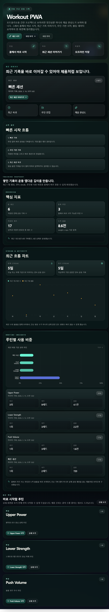
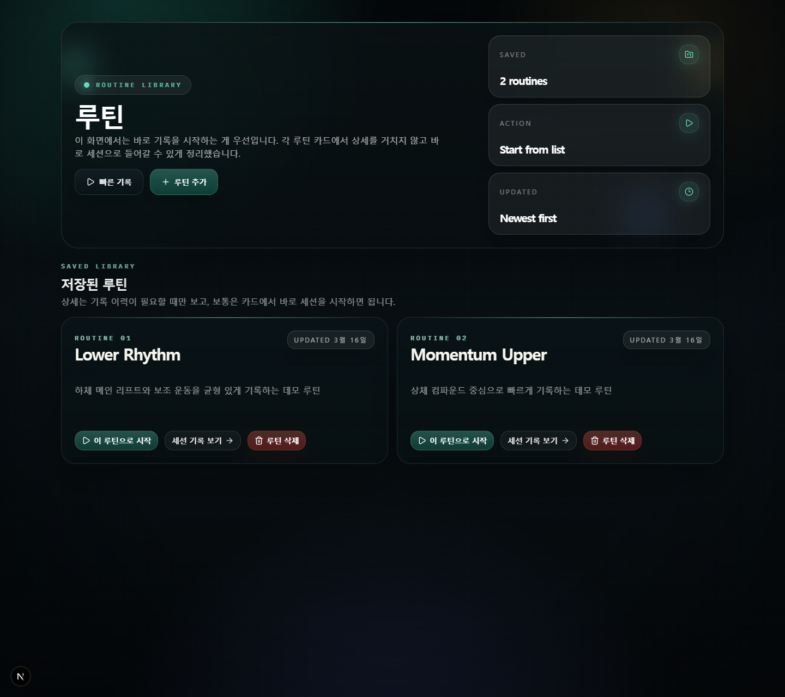
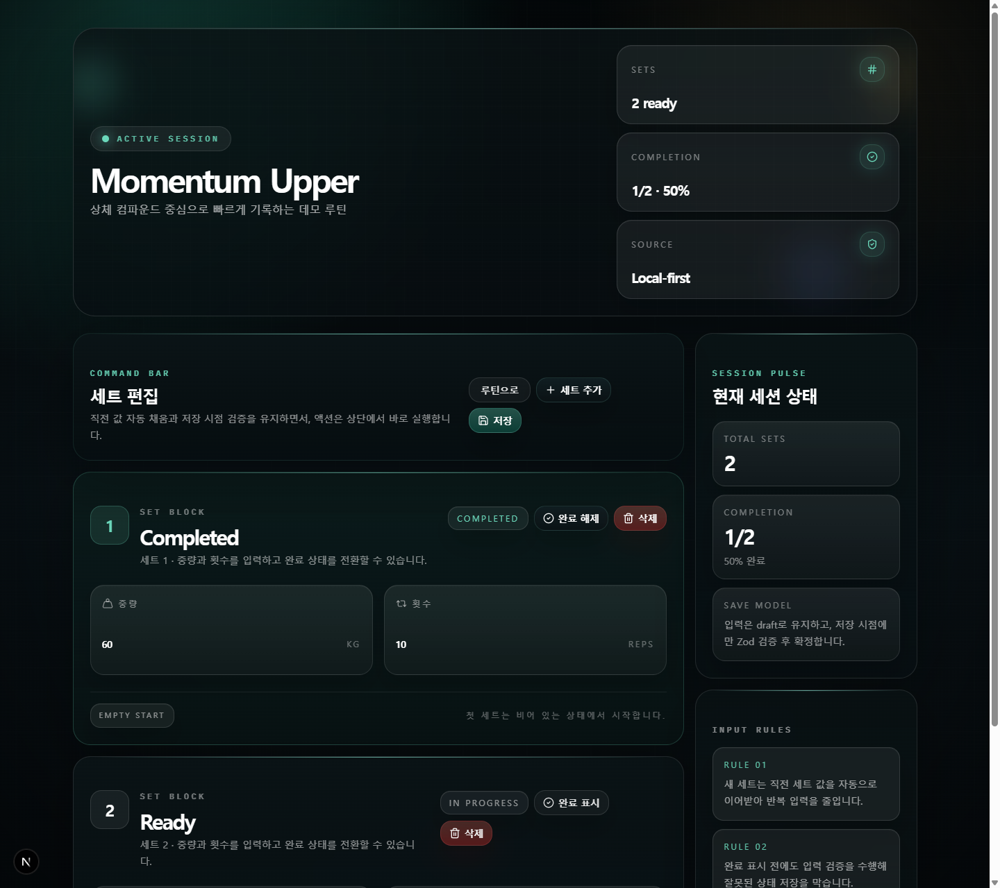

# Workout PWA

네트워크가 불안정해도 운동 기록이 끊기지 않도록 설계한 local-first PWA입니다.  
단순 CRUD가 아니라 `빠른 진입`, `최근 세션 재개`, `루틴 기반 시작`, `검증 가능한 세션 입력`, `오프라인 복구`까지 실제 제품 흐름을 완성도 있게 보여주는 것을 목표로 만들었습니다.

## 한눈에 보기

- 홈에서 `세션 시작`, `최근 세션 이어가기`, `루틴 보기`를 바로 선택할 수 있습니다.
- 루틴 목록에서 상세 화면을 거치지 않고 즉시 세션을 시작할 수 있습니다.
- 세션 화면은 단순 폼이 아니라 상태 요약과 입력 규칙을 함께 보여주는 `session console` 형태입니다.
- 저장은 local-first로 동작하며, 새로고침/재진입/오프라인 부팅에서도 기록이 유지됩니다.
- 선택적으로 outbox sync를 붙여 서버 백업 계층까지 확장할 수 있습니다.

## Latest UI (2026-03-16)







추가 캡쳐:

- [Routine Detail Edit](./docs/evidence/2026-03-16/03-routine-detail-edit.png)
- [Routine Builder](./docs/evidence/2026-03-16/05-routine-builder.png)
- [Validation Error](./docs/evidence/2026-03-16/06-validation-error.png)

## 핵심 흐름

1. 홈에서 `세션 시작` 또는 `최근 세션 이어가기`를 선택합니다.
2. 루틴이 있다면 `/routines`에서 원하는 루틴 카드의 `이 루틴으로 시작`을 누릅니다.
3. `/session/[id]`에서 세트를 추가하고, 중량/횟수를 입력한 뒤 저장합니다.
4. 저장 후 새로고침하거나 다시 진입해도 동일 데이터가 유지됩니다.
5. 빈 입력 상태에서 저장하면 검증 에러가 노출됩니다.

## 포트폴리오 포인트

- 첫 화면에서 바로 행동이 가능한 `짧은 진입 흐름`을 만들었습니다.
- 운동 상황에 맞게 직전 세트 값을 이어받는 `반복 입력 감소`를 넣었습니다.
- TypeScript만으로 끝내지 않고 Zod 기반 `런타임 검증`을 추가했습니다.
- Dexie/IndexedDB 기반 `local-first 저장`으로 오프라인 복구와 재진입 복구를 보장합니다.
- UI는 어두운 유리 패널과 네온 포인트를 사용하는 `tactical glass` 무드로 정리했습니다.

## Core Design Decisions

### 1. Draft와 Saved State 분리

- 입력 중 상태는 `draftBySetId`로 관리합니다.
- 저장 시점에만 Zod 검증 후 Zustand store와 IndexedDB에 반영합니다.
- 덕분에 입력 UX와 저장 데이터 무결성을 분리해서 다룰 수 있습니다.

### 2. Runtime Validation

- TypeScript는 컴파일 시점 안전성만 보장합니다.
- 실제 사용자 입력은 런타임 데이터이므로 Zod로 최종 검증합니다.
- `z.coerce.number()`를 사용해 숫자 입력을 안전하게 변환한 뒤 추가 조건을 적용합니다.

### 3. Local-first Persistence

- 세션과 루틴은 IndexedDB(Dexie)에 저장합니다.
- 네트워크와 무관하게 기록, 새로고침 복구, 재진입 복구가 가능합니다.
- 선택적으로 outbox sync를 활성화해 서버 백업 계층을 붙일 수 있습니다.

### 4. Repeated Input Reduction

- 새 세트는 직전 세트 값을 기본값으로 이어받습니다.
- 반복 입력량을 줄여 실제 운동 상황에 맞는 기록 흐름을 만들었습니다.

## Verification

2026년 3월 16일 기준 재검증:

- `npm run lint`
- `npm run typecheck`
- `npm run build`
- `$env:CI='1'; $env:PLAYWRIGHT_PORT='3100'; npm run test:e2e`

결과:

- `11 passed`

## Tech Stack

- Next.js 16 (App Router)
- React 19
- Zustand
- Dexie / IndexedDB
- Zod
- shadcn/ui
- Tailwind CSS 4
- Playwright

## Production URL

- [workout-pwa-jongha.vercel.app](https://workout-pwa-jongha.vercel.app/)

## Outbox Sync (Optional)

- 기본값: `NEXT_PUBLIC_SYNC_TRANSPORT=noop`
- 실연동: `NEXT_PUBLIC_SYNC_TRANSPORT=api`
- Route 활성화: `SYNC_ROUTE_ENABLED=true`

필수 ENV:

- `NEXT_PUBLIC_SUPABASE_URL`
- `NEXT_PUBLIC_SUPABASE_PUBLISHABLE_KEY`
- `SUPABASE_SERVICE_ROLE_KEY`
- `SUPABASE_SYNC_TABLE`  
  기본값은 `sync_events` 입니다.

Route handler가 전송하는 필드는 아래와 같습니다.

```sql
create table sync_events (
  id uuid primary key,
  entity_type text not null,
  entity_id text not null,
  op text not null,
  payload jsonb not null,
  client_created_at bigint not null,
  client_updated_at bigint not null,
  client_attempt_count integer not null,
  created_at timestamptz default now()
);
```

보안 기본값:

- `SYNC_ROUTE_ENABLED=false`
- service role key 누출 시 즉시 rotate 필요

## Docs

- [Development Log](./docs/DEVLOG.md)
