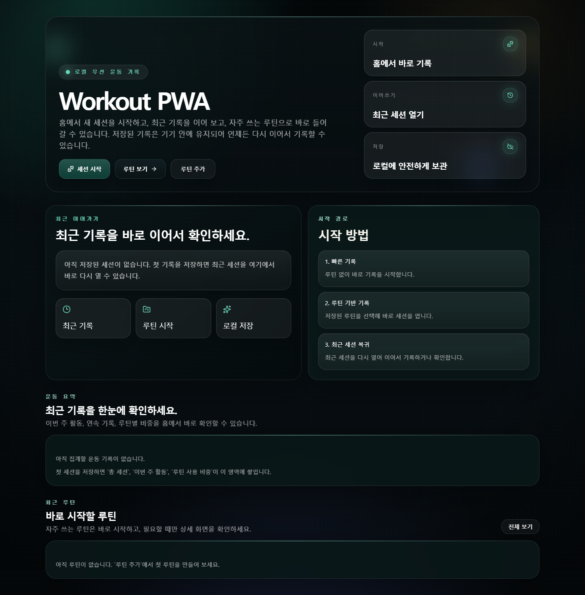
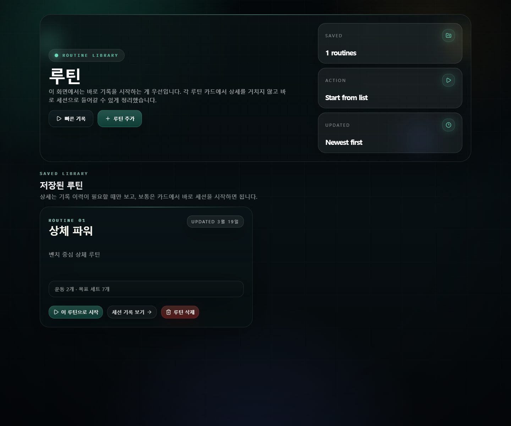
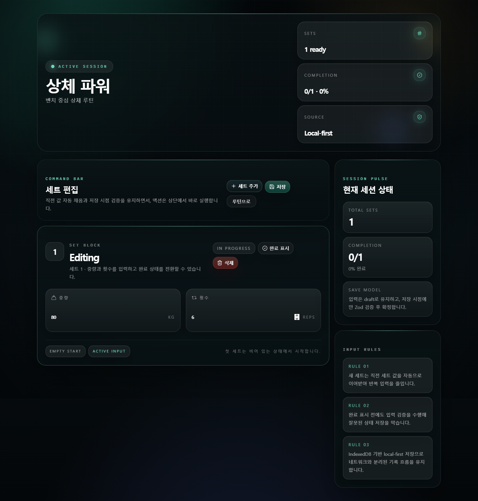

# Workout PWA

운동 기록을 빠르게 시작하고, 저장된 기록을 네트워크 상태와 무관하게 다시 이어서 볼 수 있도록 만든 local-first 운동 기록 PWA입니다.

현재 제품은 다음 흐름을 중심으로 구성되어 있습니다.

- 홈에서 `세션 시작`, `최근 세션 이어가기`, `루틴 보기`를 바로 선택
- 루틴 목록과 상세에서 세션을 다시 시작하거나 기록 이력을 확인
- 세션 화면에서 세트를 입력하고 저장 시점에만 검증
- 홈 대시보드에서 이번 주 활동, 연속 기록, 루틴별 사용 비중 확인
- 서비스 워커와 로컬 저장을 바탕으로 새로고침/재진입/오프라인 친화 동작 유지

## 현재 화면

### 홈 대시보드

홈은 첫 진입 화면이자 복귀 화면입니다. 빠른 시작, 최근 세션 재개, 최근 루틴, 활동 요약을 한 화면에 모아 기록 흐름을 짧게 유지합니다.

### 루틴 라이브러리

루틴은 이름과 설명만 저장하지 않습니다. 운동 블록, 목표 세트 수, 메모를 함께 보관하는 템플릿으로 관리되며, 목록 카드에서 바로 세션을 시작할 수 있습니다.

### 세션 에디터

세션 화면은 단순 입력 폼이 아니라, 상태 요약과 입력 규칙을 함께 보여주는 기록 콘솔에 가깝게 설계되어 있습니다. 입력 중 draft와 저장된 상태를 분리해 저장 타이밍을 제어합니다.

## 지금 이 앱이 하는 일

### 1. 빠른 시작과 재개

- 홈에서 루틴 없이 바로 세션을 시작할 수 있습니다.
- 최근 세션이 있으면 같은 화면에서 바로 다시 열 수 있습니다.
- 루틴 화면에서는 상세를 거치지 않고 바로 세션으로 들어가는 경로를 제공합니다.

### 2. 루틴 기반 기록

- 루틴은 `name + description` 수준이 아니라 운동 템플릿입니다.
- 각 루틴은 운동 이름, 정렬 순서, 목표 세트 수, 선택 메모를 가집니다.
- 루틴 상세에서는 템플릿 구조와 저장된 세션을 함께 확인할 수 있습니다.

### 3. 세션 저장과 복구

- 입력 중 상태는 임시 draft로 유지하고, 저장 시점에만 Zod 검증 후 확정합니다.
- 세션과 루틴 데이터는 IndexedDB(Dexie)에 저장됩니다.
- 새로고침 후에도 저장된 세션을 다시 열어 같은 내용을 이어서 볼 수 있습니다.

### 4. 대시보드 인사이트

- 총 세션 수, 등록 루틴 수, 저장된 세트 수, 누적 볼륨을 집계합니다.
- 이번 주 세션 수와 볼륨을 주간 차트로 보여줍니다.
- 루틴별 사용 비중을 시각화해 최근 운동 패턴을 한눈에 확인할 수 있습니다.

### 5. 오프라인 친화 동작

- 기록 자체는 로컬 저장을 기본으로 하기 때문에 네트워크와 분리되어 유지됩니다.
- 서비스 워커가 설치된 뒤에는 홈과 루틴 등 핵심 화면 app shell을 다시 열 수 있습니다.
- 문서 요청 실패 시 `offline.html` 안내 화면으로 fallback 됩니다.

## 핵심 설계 결정

### Draft와 Saved State 분리

- 세션 입력은 `draftBySetId`로 관리합니다.
- 저장 버튼을 누를 때만 Zod 검증 후 Zustand store와 IndexedDB에 반영합니다.
- 입력 UX와 저장 데이터 무결성을 분리해 다룰 수 있습니다.

### Local-first Persistence

- 세션과 루틴은 Dexie를 통해 IndexedDB에 저장합니다.
- 라우트 재진입이나 새로고침 이후에도 저장된 데이터를 다시 불러올 수 있습니다.
- 선택적으로 outbox sync를 붙일 수 있도록 저장소 구조를 분리해 두었습니다.

### Runtime Validation

- TypeScript만으로는 사용자 입력의 런타임 품질을 보장할 수 없습니다.
- 세션 세트와 루틴 템플릿은 Zod로 최종 검증합니다.
- 숫자 입력은 coercion 후 범위 제한을 적용해 저장 시점에 확정합니다.

## 주요 사용자 흐름

1. 홈에서 `세션 시작`, `최근 세션 이어가기`, `루틴 보기` 중 하나를 선택합니다.
2. 루틴을 새로 만들 경우 운동 블록과 목표 세트 수를 포함한 템플릿을 저장합니다.
3. 루틴 목록 또는 루틴 상세에서 `이 루틴으로 시작`으로 세션을 엽니다.
4. 세션 화면에서 세트를 입력하고 저장합니다.
5. 홈으로 돌아오면 최근 세션과 대시보드 집계가 즉시 반영됩니다.

## 검증

문서 갱신 시점 로컬 재검증:

- `npm run lint`
- `npm run typecheck`
- `npm run build`
- `PLAYWRIGHT_BASE_URL=http://127.0.0.1:3210 PLAYWRIGHT_PORT=3210 npx playwright test tests/session-persistence.spec.ts -g "routine template|starts a session directly from routine detail"`

## 짧은 트러블슈팅 메모

### Zustand selector 참조 안정성

`state.sessions[sessionId] ?? []` 같은 fallback 배열을 selector 내부에서 만들면 렌더마다 새 참조가 생겨 `getSnapshot` 경고가 날 수 있습니다. 이 저장소에서는 selector는 원본 값만 읽고, 기본값은 컴포넌트 레벨에서 처리합니다.

### 오프라인 fallback 범위

서비스 워커 fallback은 “앱이 처음부터 완전 오프라인”을 보장하는 장치가 아닙니다. 온라인 상태에서 한 번 방문해 SW가 설치된 뒤, 문서 요청(`navigate`) 실패 시 핵심 화면 셸과 `offline.html` 안내를 제공하는 범위로 설계했습니다.

### 새 세션 bootstrap 경로

빠른 시작과 오프라인 시작 경로는 고정 세션 id를 재사용하면 충돌하기 쉽습니다. 이 저장소는 pending session id와 bootstrap 처리를 분리해, 새 세션 진입 경로가 저장 흐름과 충돌하지 않도록 정리했습니다.

## Tech Stack

- Next.js 16 (App Router)
- React 19
- Zustand
- Dexie / IndexedDB
- Zod
- Tailwind CSS 4
- shadcn/ui
- Playwright

## Production URL

- [workout-pwa-jongha.vercel.app](https://workout-pwa-jongha.vercel.app/)

## Optional Sync

- 기본값: `NEXT_PUBLIC_SYNC_TRANSPORT=noop`
- 실연동: `NEXT_PUBLIC_SYNC_TRANSPORT=api`
- Route 활성화: `SYNC_ROUTE_ENABLED=true`

필수 환경변수:

- `NEXT_PUBLIC_SUPABASE_URL`
- `NEXT_PUBLIC_SUPABASE_PUBLISHABLE_KEY`
- `SUPABASE_SERVICE_ROLE_KEY`
- `SUPABASE_SYNC_TABLE`

## Docs

- [Development Log](./docs/DEVLOG.md)
