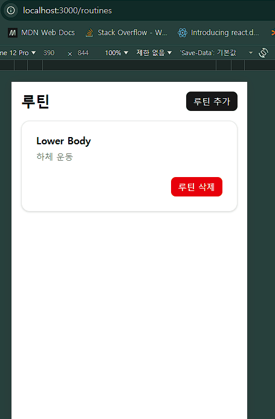
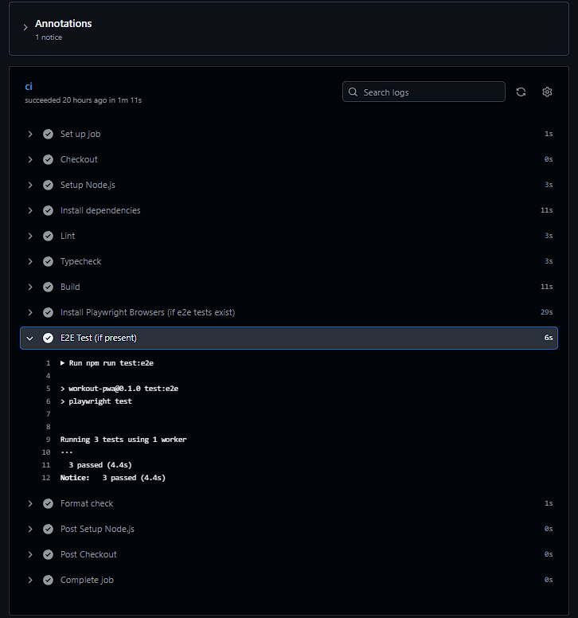
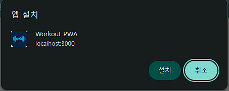

# Development Log

## 2026-02-14

### 요약

- 오프라인 우선 기록 UX를 위해 세션 상태는 네트워크와 분리된 로컬 상태로 설계했다.

### 구현

- 세트 리스트에서 마지막 세트 카드 강조 UI 적용
- 세트 CRUD (추가/수정/삭제) 흐름 정리
- Zustand 기반 세션 상태 관리 구조 고정
- Zod 기반 런타임 입력 검증 적용
- 최근값 자동 채움 UX 반영

### 설계 판단

- 입력 중 상태(`draft`)와 확정 상태(store)를 분리해 저장 타이밍 제어
- selector 내부 fallback 생성 대신 컴포넌트 레벨 기본값 처리로 참조 안정성 유지
- 마지막 세트는 진행 중 포커스로 간주해 시각적으로 구분

### 트러블슈팅

#### Zustand selector 참조 문제

`state.sessions[sessionId] ?? []` 형태의 fallback이 매 렌더마다 새로운 배열을 생성해
React `getSnapshot` 경고가 발생.

- selector 내부 fallback 제거
- 컴포넌트 레벨에서 `safeSets` 기본값 처리

### 배운 점

- 런타임 검증은 폼 UX와 데이터 품질을 동시에 지켜준다
- 불변성 보장과 참조 안정성은 별도로 설계해야 한다
- 사용자 입력 흐름(추가/수정/저장) 단계 분리가 유지보수성을 높인다

### 다음 액션

- [ ] 핵심 기록 플로우 안정화 이후 백업/동기화 계층 설계 초안 작성 → **이월**

→ Day1에서는 핵심 기록 플로우를 안정화하는 데 집중했다.

---

## 2026-02-15

### 요약

- ESLint/Prettier ignore 설정 정리하여 CI 환경과 로컬 환경 차이 제거

### 목표

- [x] GitHub repo 생성 및 첫 push
- [x] GitHub Actions CI 추가 (`lint` / `typecheck` / `build`)
- [x] Supabase 도입 전, Local-first 전략 결정 (README 목표와 정합성 검토)

### 운영 및 인프라

- `.github/workflows/ci.yml` 추가
- 트리거: `push`, `pull_request` on `main`
- 실행: Node 20, `npm ci`, `npm run lint`, `npm run typecheck`, `npm run build`

### CI 이슈

- `format:check` 스크립트가 원격에 반영되지 않아 CI 실패 → package.json 커밋으로 해결
- Prettier 포맷 불일치로 format check 실패 → `npm run format` 적용 후 재실행 예정

### Evidence

- Commit(s):
  - https://github.com/jongha1230/workout-pwa/commit/a7bd1d49fac48aa7ae257b13111d16c1137ff1e4
  - https://github.com/jongha1230/workout-pwa/commit/20f2a50d364dabb452793754935c51409e31c27b
  - https://github.com/jongha1230/workout-pwa/commit/cf2ec690e34fdfeb509a94b617fef5efe8299f4c
- CI:
  - https://github.com/jongha1230/workout-pwa/actions/runs/22039189528
- Repro/Verify:
  1. `npm ci` 실행 후 `npm run format:check` 통과 확인
  2. `npm run lint`, `npm run typecheck`, `npm run build` 순서로 실행하고 모두 통과 확인
  3. GitHub Actions CI run에서 동일 스크립트 성공 상태 확인

### 전략 메모

- README 목표상 네트워크가 불안정해도 운동 기록이 끊기면 안 된다.
- 따라서 현재 단계에서는 Local-first를 기본으로 유지한다.
- Supabase는 이후 선택적 동기화/백업 계층으로 도입한다.

### 리스크 관리

- Supabase를 1단계에서 바로 도입하지 않고,
  Local-first 기반을 먼저 안정화해 제품 목표와 기술 구조의 충돌을 방지한다.

### 배운 점

- CI 실패는 대부분 설정 누락이나 반영 누락에서 발생한다.
- Git rebase와 stash는 무섭지만, 흐름을 이해하면 충분히 복구 가능하다.
- 코드 품질 게이트를 초기에 구축하는 것이 중요하다.

### 다음 액션

- [x] 첫 push 후 GitHub Actions 실행 확인
- [x] CI 결과 반영해 체크 상태 업데이트
- [x] IndexedDB(Dexie)로 sessions 영속화(새로고침 복구)
- [ ] Supabase sync draft 설계(offline queue) → **이월**

→ Day2에서는 코드 품질과 운영 기반을 정리했다.

---

## 2026-02-17

### 요약

- Local-first를 유지한 상태에서 IA(정보구조) 분리와 세션 기록 UX를 정리했다.

### 구현

- IA 책임 분리: Home(내비) / Routines(list,new,detail) / Session(logging)
- Dexie 기반 로컬 영속화 유지(`sessions`,`routines`) + repository/store hydration/persist 연결
- 세션 저장 UX 개선: 저장 후 자동 리디렉션 제거, `루틴으로` 이동 버튼 제공, 토스트 유지
- 자동 채움 정책 정리: 같은 세션의 직전 세트만 seed, 첫 세트는 빈 입력에서 시작
- 세트 완료 상태(checkbox) 저장/복구 지원
  - 완료 체크 시 해당 세트 값 검증 후 즉시 저장
  - `/routines/[id]`에서는 `완료 x/y` 요약만 노출
- 루틴/세션 관리 UX 보강
  - `/routines`: 카드 클릭으로 상세 진입 + 루틴 삭제
  - `/routines/[id]`: 루틴 삭제 + 세션 카드 클릭 진입 + 세션 삭제
- Playwright E2E를 최신 플로우에 맞게 갱신 및 CI 재검증

### CI

- 포맷/정적 검사/빌드/E2E 기준으로 재검증 완료 (`format:check`, `lint`, `typecheck`, `build`, `test:e2e`)

### Evidence

- Commit(s):
  - https://github.com/jongha1230/workout-pwa/commit/6d0da5bf0fc8a8263302ec35e207347d934540d7
  - https://github.com/jongha1230/workout-pwa/commit/5e1c317ea26cca2d4fffb501a363f5d6a58e49ed
  - https://github.com/jongha1230/workout-pwa/commit/d16c8bc083058b1e7c50e95076221bbdb52dc9e8
  - https://github.com/jongha1230/workout-pwa/commit/f5338dd61e70938a6d1d57fcc5c8d25f3cfc9cea
  - https://github.com/jongha1230/workout-pwa/commit/90715d9fe69163cf10aa3758665731b043d0a06d
- CI:
  - https://github.com/jongha1230/workout-pwa/actions/runs/22101171797
- Repro/Verify:
  1. `/routines` → 루틴 선택(카드 클릭) → `이 루틴으로 시작`으로 세션 진입
  2. 세트 추가 후 중량/횟수 입력 및 저장 → 새로고침(F5) 및 재진입(`/session/[id]`) 시 동일 데이터 복구 확인
  3. 세트 `완료` 체크 후 `/routines/[id]`에서 완료 요약(`완료 x/y`) 반영 확인

### DoD

- [x] 라우팅 책임이 화면 목적에 맞게 분리되었다
- [x] 저장 후 세션 페이지 stay + 루틴 이동 UX가 동작한다
- [x] 세션 자동 채움이 "같은 세션 내부"로 제한되었다
- [x] 완료 체크 상태가 저장/복구되고 루틴 상세에는 요약으로만 노출된다
- [x] 새로고침/재진입 시 로컬 복구 동작을 수동으로 확인했다

### 배운 점

- 기능 확장보다 정보구조(IA) 재정렬이 사용자 경험 개선에 더 직접적인 영향을 준다.
- 예측 가능한 자동 채움 정책이 “기능 많음”보다 더 높은 UX 신뢰를 만든다.
- 저장 동작은 사용자 통제 하에 두는 것이 피로도를 낮춘다.

### 다음 액션

- [ ] (선택) persist 호출 debounce 적용(입력 중 과도 저장 방지) → **보류**
- [ ] 루틴/세션 이름 정책(기본 제목, 사용자 지정 UX) 정리 → **이월**
- [ ] Supabase sync draft 설계(offline queue) → **이월**

→ Day3에서는 기능 중심 MVP를 사용자 중심 구조로 재정렬했다.

---

## 2026-02-18

### 요약

- 일반 사용자 시작 경로에서 `/session/new`를 거치지 않도록 플로우를 변경했다.
- 루틴 상세의 `이 루틴으로 시작` 클릭 시 세션을 생성하고 바로 `/session/[id]`로 이동한다.
- Playwright E2E + GIF 기반 재검증 완료

### Evidence

- 핵심 증거:
  
  
- Flow/UI 링크:
  - [Home CTA](./evidence/2026-02-18/01-home-cta.png)
  - [Routine Detail (empty)](./evidence/2026-02-18/02-routine-detail-empty.png)
  - [Session Editor](./evidence/2026-02-18/03-session-editor-filled.png)
  - [Save Toast](./evidence/2026-02-18/04-save-toast.png)
  - [Routine Detail (saved sessions)](./evidence/2026-02-18/05-routine-detail-saved-sessions.png)
  - [Validation Error](./evidence/2026-02-18/06-validation-error.png)
  - [URL: Routine Detail](./evidence/2026-02-18/07-url-routine-detail.png)
  - [URL: Session Editor](./evidence/2026-02-18/08-url-session-editor.png)

### Repro/Verify (GIF 기준)

1. `/routines`에서 루틴 카드를 눌러 `/routines/{routineId}`로 이동한다.
2. `이 루틴으로 시작`을 눌러 `/session/{sessionId}`로 이동한다. (`/session/new` 미경유)
3. `세트 추가`를 누르고 중량 `60`, 횟수 `10`을 입력한 뒤 `저장`을 누른다.
4. 상단 `Saved session successfully` 토스트를 확인한다.
5. `루틴으로`를 눌러 `/routines/{routineId}`로 돌아가 `저장된 세션` 카드가 생성됐는지 확인한다.
6. `저장된 세션` 카드를 눌러 `/session/{sessionId}`로 다시 진입해 값(`60`, `10`)이 유지되는지 확인한다.

→ Day4에서는 세션 플로우 변경 이후, E2E 및 수동 재현(GIF)을 통해 로컬 복구 동작을 명확히 검증하고 Evidence를 정리했다.

---

## 2026-02-19

### 요약

- Playwright E2E 시작점을 `/session/new`에서 홈 CTA(`/`) 기반 플로우로 정렬했다.
- `/session/new` 경로는 fallback entry로 유지되는지 별도 스모크 테스트를 추가했다.
- 핵심 사용자 경로 회귀 검증과 fallback 경로 가용성 검증을 분리해 테스트 신뢰도를 높였다.

### 변경 사항

- `tests/session-persistence.spec.ts`
  - `startSession()` 시작 경로를 `/`로 변경
  - `new session route remains available as fallback entry` 테스트 추가

### Local Verify

- `npm run test:e2e` → 4 passed

### 기존 미완료 액션 점검

- [ ] (02-17) persist debounce 적용 → **보류**
  - 현재 저장은 `submit/완료체크/삭제` 중심이라 입력 중 과도 저장 이슈가 크지 않음
- [ ] (02-17) 루틴/세션 이름 정책 정리 → **이월**
  - invalid id 처리 정책 확정 이후, 빈 상태/기본 제목 UX와 함께 정리 예정
- [ ] (02-15, 02-17) Supabase sync draft 설계 → **이월**
  - 현재 단계는 Local-first 검증 완성도가 우선이며 sync는 2차 설계 항목으로 분리

### 다음 액션 (우선순위)

- [x] P0: 루틴 상세(`/routines/[id]`)의 `이 루틴으로 시작` 경로 E2E 1개 추가 (2026-02-20 완료)
- [x] P0: `/session/[id]` invalid id 처리 정책 확정(404/안내/리다이렉트) + 테스트 반영 (2026-02-20 완료)
- [x] P1: `src/app/layout.tsx` 메타데이터 기본값(`Create Next App`) 프로젝트 문구로 교체 (2026-02-20 완료)
- [x] P1: DEVLOG 과거 `다음 액션` 항목에 상태 라벨(완료/보류/이월) 반영 (2026-02-20 완료)

→ Day5에서는 테스트를 실제 사용자 경로에 맞춰 정렬하고, 미완료 백로그를 우선순위 기준으로 재분류했다.

---

## 2026-02-20

### 요약

- P0-1: 루틴 상세(`/routines/[id]`)의 `이 루틴으로 시작` 경로 E2E를 추가했다.
- P0-2: `/session/[id]` 접근 시 invalid/missing id를 구분해 안내하고 편집 폼 노출을 차단했다.
- invalid id, missing id 각각에 대한 회귀 테스트를 추가했다.
- P1: `src/app/layout.tsx` 메타데이터 기본값을 프로젝트 문구로 교체했다.
- P1: DEVLOG 과거 `다음 액션` 항목에 상태 라벨(완료/보류/이월)을 반영했다.

### 변경 사항

- `tests/session-persistence.spec.ts`
  - `starts a session directly from routine detail` 테스트 추가
  - `invalid session id shows guidance instead of editable form` 테스트 추가
  - `missing session id shows not-found guidance` 테스트 추가
- `src/app/session/[id]/page.tsx`
  - `SESSION_ID_PATTERN` 기반 session id 형식 검증 추가
  - invalid id/없는 session id 접근 시 안내 카드 렌더링
  - 안내 상태에서 세트 입력 폼 미노출 처리
- `src/app/layout.tsx`
  - 메타데이터 기본값을 `Workout PWA` / 프로젝트 설명으로 교체
- `docs/DEVLOG.md`
  - 과거 `다음 액션` 항목 상태 라벨(완료/보류/이월) 정리

### CI

- `format:check` failed due to Prettier mismatch in `tests/session-persistence.spec.ts`.
- Fixed in `ba6d287` (`chore(prettier): format session persistence spec`) and re-pushed.
- Green run: https://github.com/jongha1230/workout-pwa/actions/runs/22227897937

### Local Verify

- `npm run typecheck` → passed
- `npm run test:e2e` → 7 passed

### Evidence

- Commit(s):
  - https://github.com/jongha1230/workout-pwa/commit/088de742a30bd7d18fc64a2609e2ad64fc6d0bab
  - https://github.com/jongha1230/workout-pwa/commit/43799ad3edf9111d5003d4292c0d05a151b0192d
  - https://github.com/jongha1230/workout-pwa/commit/cf8ed4077c97dc309e583c511d6f7b79a598bc39
- PR:
  - https://github.com/jongha1230/workout-pwa/pull/3

### 다음 액션

- [x] P1: `src/app/layout.tsx` 메타데이터 기본값(`Create Next App`) 프로젝트 문구로 교체 (2026-02-20 완료)
- [x] P1: DEVLOG 과거 `다음 액션` 항목에 상태 라벨(완료/보류/이월) 반영 (2026-02-20 완료)

→ Day6에서는 P0/P1을 마무리하고 CI 안정화(format/typecheck/e2e)까지 확인했다.

---

## 2026-02-21

### 요약

- PWA 설치 최소 요건(`manifest`, `theme-color`, 앱 아이콘)을 연결했다.
- 파비콘 네이밍을 표준 형태(`favicon-16x16`, `favicon-32x32`, `favicon-48x48`)로 정리했다.
- Chrome에서 설치 팝업 노출을 확인했다.

### 변경 사항

- `public/manifest.webmanifest` 추가
  - `start_url`, `display`, `theme_color`, `icons` 설정
- `src/app/layout.tsx`
  - `<link rel="manifest" href="/manifest.webmanifest" />` 추가
  - `<meta name="theme-color" content="#ffffff" />` 추가
- `public/icons`
  - `icon-192.png`, `icon-512.png` 추가
  - `favicon-16x16.png`, `favicon-32x32.png`, `favicon-48x48.png`로 정리

### Evidence

- Install Prompt (cropped): 
- Install Prompt (full): [02-install-prompt-full.png](./evidence/2026-02-21/02-install-prompt-full.png)

### Local Verify

- `icon-192.png` → `192x192`
- `icon-512.png` → `512x512`
- `favicon-16x16.png` → `16x16`
- `favicon-32x32.png` → `32x32`
- `favicon-48x48.png` → `48x48`
- `localhost`에서 설치 팝업 노출 확인

### 다음 액션

- [ ] (선택) `apple-touch-icon` 및 `maskable` 아이콘 추가
- [ ] `favicon.ico` 멀티 사이즈(16/32/48) 정리

→ Day7에서는 PWA 설치 요건 연결과 설치 팝업 확인까지 마무리했다.
