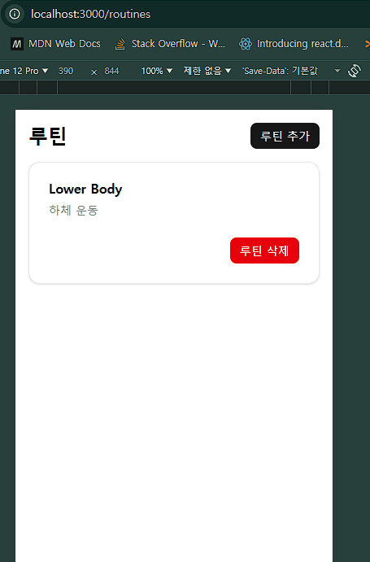
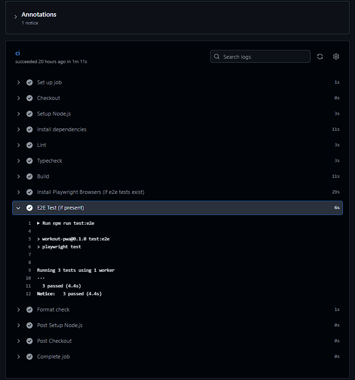
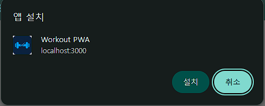
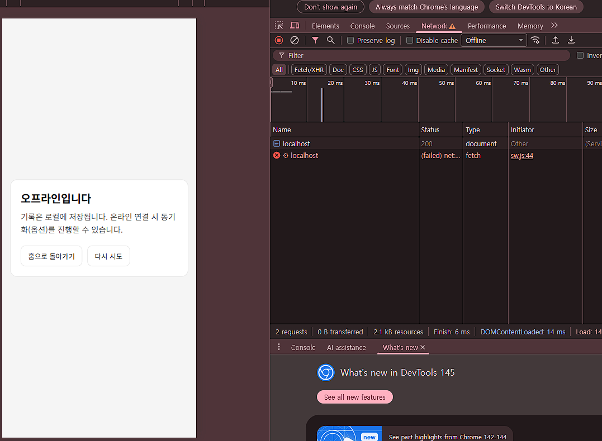

# Development Log

## 2026-02-14

### ?붿빟

- ?ㅽ봽?쇱씤 ?곗꽑 湲곕줉 UX瑜??꾪빐 ?몄뀡 ?곹깭???ㅽ듃?뚰겕?€ 遺꾨━??濡쒖뺄 ?곹깭濡??ㅺ퀎?덈떎.

### 援ы쁽

- ?명듃 由ъ뒪?몄뿉??留덉?留??명듃 移대뱶 媛뺤“ UI ?곸슜
- ?명듃 CRUD (異붽?/?섏젙/??젣) ?먮쫫 ?뺣━
- Zustand 湲곕컲 ?몄뀡 ?곹깭 愿€由?援ъ“ 怨좎젙
- Zod 湲곕컲 ?고????낅젰 寃€利??곸슜
- 理쒓렐媛??먮룞 梨꾩? UX 諛섏쁺

### ?ㅺ퀎 ?먮떒

- ?낅젰 以??곹깭(`draft`)?€ ?뺤젙 ?곹깭(store)瑜?遺꾨━???€???€?대컢 ?쒖뼱
- selector ?대? fallback ?앹꽦 ?€??而댄룷?뚰듃 ?덈꺼 湲곕낯媛?泥섎━濡?李몄“ ?덉젙???좎?
- 留덉?留??명듃??吏꾪뻾 以??ъ빱?ㅻ줈 媛꾩＜???쒓컖?곸쑝濡?援щ텇

### ?몃윭釉붿뒋??

#### Zustand selector 李몄“ 臾몄젣

`state.sessions[sessionId] ?? []` ?뺥깭??fallback??留??뚮뜑留덈떎 ?덈줈??諛곗뿴???앹꽦??
React `getSnapshot` 寃쎄퀬媛€ 諛쒖깮.

- selector ?대? fallback ?쒓굅
- 而댄룷?뚰듃 ?덈꺼?먯꽌 `safeSets` 湲곕낯媛?泥섎━

### 諛곗슫 ??

- ?고???寃€利앹? ??UX?€ ?곗씠???덉쭏???숈떆??吏€耳쒖???
- 遺덈???蹂댁옣怨?李몄“ ?덉젙?깆? 蹂꾨룄濡??ㅺ퀎?댁빞 ?쒕떎
- ?ъ슜???낅젰 ?먮쫫(異붽?/?섏젙/?€?? ?④퀎 遺꾨━媛€ ?좎?蹂댁닔?깆쓣 ?믪씤??

### ?ㅼ쓬 ?≪뀡

- [ ] ?듭떖 湲곕줉 ?뚮줈???덉젙???댄썑 諛깆뾽/?숆린??怨꾩링 ?ㅺ퀎 珥덉븞 ?묒꽦 ??**?댁썡**

??Day1?먯꽌???듭떖 湲곕줉 ?뚮줈?곕? ?덉젙?뷀븯????吏묒쨷?덈떎.

---

## 2026-02-15

### ?붿빟

- ESLint/Prettier ignore ?ㅼ젙 ?뺣━?섏뿬 CI ?섍꼍怨?濡쒖뺄 ?섍꼍 李⑥씠 ?쒓굅

### 紐⑺몴

- [x] GitHub repo ?앹꽦 諛?泥?push
- [x] GitHub Actions CI 異붽? (`lint` / `typecheck` / `build`)
- [x] Supabase ?꾩엯 ?? Local-first ?꾨왂 寃곗젙 (README 紐⑺몴?€ ?뺥빀??寃€??

### ?댁쁺 諛??명봽??

- `.github/workflows/ci.yml` 異붽?
- ?몃━嫄? `push`, `pull_request` on `main`
- ?ㅽ뻾: Node 20, `npm ci`, `npm run lint`, `npm run typecheck`, `npm run build`

### CI ?댁뒋

- `format:check` ?ㅽ겕由쏀듃媛€ ?먭꺽??諛섏쁺?섏? ?딆븘 CI ?ㅽ뙣 ??package.json 而ㅻ컠?쇰줈 ?닿껐
- Prettier ?щ㎎ 遺덉씪移섎줈 format check ?ㅽ뙣 ??`npm run format` ?곸슜 ???ъ떎???덉젙

### Evidence

- Commit(s):
  - https://github.com/jongha1230/workout-pwa/commit/a7bd1d49fac48aa7ae257b13111d16c1137ff1e4
  - https://github.com/jongha1230/workout-pwa/commit/20f2a50d364dabb452793754935c51409e31c27b
  - https://github.com/jongha1230/workout-pwa/commit/cf2ec690e34fdfeb509a94b617fef5efe8299f4c
- CI:
  - https://github.com/jongha1230/workout-pwa/actions/runs/22039189528
- Repro/Verify:
  1. `npm ci` ?ㅽ뻾 ??`npm run format:check` ?듦낵 ?뺤씤
  2. `npm run lint`, `npm run typecheck`, `npm run build` ?쒖꽌濡??ㅽ뻾?섍퀬 紐⑤몢 ?듦낵 ?뺤씤
  3. GitHub Actions CI run?먯꽌 ?숈씪 ?ㅽ겕由쏀듃 ?깃났 ?곹깭 ?뺤씤

### ?꾨왂 硫붾え

- README 紐⑺몴???ㅽ듃?뚰겕媛€ 遺덉븞?뺥빐???대룞 湲곕줉???딄린硫????쒕떎.
- ?곕씪???꾩옱 ?④퀎?먯꽌??Local-first瑜?湲곕낯?쇰줈 ?좎??쒕떎.
- Supabase???댄썑 ?좏깮???숆린??諛깆뾽 怨꾩링?쇰줈 ?꾩엯?쒕떎.

### 由ъ뒪??愿€由?

- Supabase瑜?1?④퀎?먯꽌 諛붾줈 ?꾩엯?섏? ?딄퀬,
  Local-first 湲곕컲??癒쇱? ?덉젙?뷀빐 ?쒗뭹 紐⑺몴?€ 湲곗닠 援ъ“??異⑸룎??諛⑹??쒕떎.

### 諛곗슫 ??

- CI ?ㅽ뙣???€遺€遺??ㅼ젙 ?꾨씫?대굹 諛섏쁺 ?꾨씫?먯꽌 諛쒖깮?쒕떎.
- Git rebase?€ stash??臾댁꽠吏€留? ?먮쫫???댄빐?섎㈃ 異⑸텇??蹂듦뎄 媛€?ν븯??
- 肄붾뱶 ?덉쭏 寃뚯씠?몃? 珥덇린??援ъ텞?섎뒗 寃껋씠 以묒슂?섎떎.

### ?ㅼ쓬 ?≪뀡

- [x] 泥?push ??GitHub Actions ?ㅽ뻾 ?뺤씤
- [x] CI 寃곌낵 諛섏쁺??泥댄겕 ?곹깭 ?낅뜲?댄듃
- [x] IndexedDB(Dexie)濡?sessions ?곸냽???덈줈怨좎묠 蹂듦뎄)
- [ ] Supabase sync draft ?ㅺ퀎(offline queue) ??**?댁썡**

??Day2?먯꽌??肄붾뱶 ?덉쭏怨??댁쁺 湲곕컲???뺣━?덈떎.

---

## 2026-02-17

### ?붿빟

- Local-first瑜??좎????곹깭?먯꽌 IA(?뺣낫援ъ“) 遺꾨━?€ ?몄뀡 湲곕줉 UX瑜??뺣━?덈떎.

### 援ы쁽

- IA 梨낆엫 遺꾨━: Home(?대퉬) / Routines(list,new,detail) / Session(logging)
- Dexie 湲곕컲 濡쒖뺄 ?곸냽???좎?(`sessions`,`routines`) + repository/store hydration/persist ?곌껐
- ?몄뀡 ?€??UX 媛쒖꽑: ?€?????먮룞 由щ뵒?됱뀡 ?쒓굅, `猷⑦떞?쇰줈` ?대룞 踰꾪듉 ?쒓났, ?좎뒪???좎?
- ?먮룞 梨꾩? ?뺤콉 ?뺣━: 媛숈? ?몄뀡??吏곸쟾 ?명듃留?seed, 泥??명듃??鍮??낅젰?먯꽌 ?쒖옉
- ?명듃 ?꾨즺 ?곹깭(checkbox) ?€??蹂듦뎄 吏€??
  - ?꾨즺 泥댄겕 ???대떦 ?명듃 媛?寃€利???利됱떆 ?€??
  - `/routines/[id]`?먯꽌??`?꾨즺 x/y` ?붿빟留??몄텧
- 猷⑦떞/?몄뀡 愿€由?UX 蹂닿컯
  - `/routines`: 移대뱶 ?대┃?쇰줈 ?곸꽭 吏꾩엯 + 猷⑦떞 ??젣
  - `/routines/[id]`: 猷⑦떞 ??젣 + ?몄뀡 移대뱶 ?대┃ 吏꾩엯 + ?몄뀡 ??젣
- Playwright E2E瑜?理쒖떊 ?뚮줈?곗뿉 留욊쾶 媛깆떊 諛?CI ?ш?利?

### CI

- ?щ㎎/?뺤쟻 寃€??鍮뚮뱶/E2E 湲곗??쇰줈 ?ш?利??꾨즺 (`format:check`, `lint`, `typecheck`, `build`, `test:e2e`)

### Evidence

- Commit(s):
  - https://github.com/jongha1230/workout-pwa/commit/6d0da5bf0fc8a8263302ec35e207347d934540d7
  - https://github.com/jongha1230/workout-pwa/commit/5e1c317ea26cca2d4fffb501a363f5d6a58e49ed
  - https://github.com/jongha1230/workout-pwa/commit/d16c8bc083058b1e7c50e95076221bbdb52dc9e8
  - https://github.com/jongha1230/workout-pwa/commit/f5338dd61e70938a6d1d57fcc5c8d25f3cfc9cea
  - https://github.com/jongha1230/workout-pwa/commit/90715d9fe69163cf10aa3758665731b043d0a06d
- CI:
  - https://github.com/jongha1230/workout-pwa/actions/runs/22101171797
- Repro/Verify:
  1. `/routines` ??猷⑦떞 ?좏깮(移대뱶 ?대┃) ??`??猷⑦떞?쇰줈 ?쒖옉`?쇰줈 ?몄뀡 吏꾩엯
  2. ?명듃 異붽? ??以묐웾/?잛닔 ?낅젰 諛??€?????덈줈怨좎묠(F5) 諛??ъ쭊??`/session/[id]`) ???숈씪 ?곗씠??蹂듦뎄 ?뺤씤
  3. ?명듃 `?꾨즺` 泥댄겕 ??`/routines/[id]`?먯꽌 ?꾨즺 ?붿빟(`?꾨즺 x/y`) 諛섏쁺 ?뺤씤

### DoD

- [x] ?쇱슦??梨낆엫???붾㈃ 紐⑹쟻??留욊쾶 遺꾨━?섏뿀??
- [x] ?€?????몄뀡 ?섏씠吏€ stay + 猷⑦떞 ?대룞 UX媛€ ?숈옉?쒕떎
- [x] ?몄뀡 ?먮룞 梨꾩???"媛숈? ?몄뀡 ?대?"濡??쒗븳?섏뿀??
- [x] ?꾨즺 泥댄겕 ?곹깭媛€ ?€??蹂듦뎄?섍퀬 猷⑦떞 ?곸꽭?먮뒗 ?붿빟?쇰줈留??몄텧?쒕떎
- [x] ?덈줈怨좎묠/?ъ쭊????濡쒖뺄 蹂듦뎄 ?숈옉???섎룞?쇰줈 ?뺤씤?덈떎

### 諛곗슫 ??

- 湲곕뒫 ?뺤옣蹂대떎 ?뺣낫援ъ“(IA) ?ъ젙?ъ씠 ?ъ슜??寃쏀뿕 媛쒖꽑????吏곸젒?곸씤 ?곹뼢??以€??
- ?덉륫 媛€?ν븳 ?먮룞 梨꾩? ?뺤콉???쒓린??留롮쓬?앸낫?????믪? UX ?좊ː瑜?留뚮뱺??
- ?€???숈옉?€ ?ъ슜???듭젣 ?섏뿉 ?먮뒗 寃껋씠 ?쇰줈?꾨? ??텣??

### ?ㅼ쓬 ?≪뀡

- [ ] (?좏깮) persist ?몄텧 debounce ?곸슜(?낅젰 以?怨쇰룄 ?€??諛⑹?) ??**蹂대쪟**
- [ ] 猷⑦떞/?몄뀡 ?대쫫 ?뺤콉(湲곕낯 ?쒕ぉ, ?ъ슜??吏€??UX) ?뺣━ ??**?댁썡**
- [ ] Supabase sync draft ?ㅺ퀎(offline queue) ??**?댁썡**

??Day3?먯꽌??湲곕뒫 以묒떖 MVP瑜??ъ슜??以묒떖 援ъ“濡??ъ젙?ы뻽??

---

## 2026-02-18

### ?붿빟

- ?쇰컲 ?ъ슜???쒖옉 寃쎈줈?먯꽌 `/session/new`瑜?嫄곗튂吏€ ?딅룄濡??뚮줈?곕? 蹂€寃쏀뻽??
- 猷⑦떞 ?곸꽭??`??猷⑦떞?쇰줈 ?쒖옉` ?대┃ ???몄뀡???앹꽦?섍퀬 諛붾줈 `/session/[id]`濡??대룞?쒕떎.
- Playwright E2E + GIF 湲곕컲 ?ш?利??꾨즺

### Evidence

- ?듭떖 利앷굅:
  
  
- Flow/UI 留곹겕:
  - [Home CTA](./evidence/2026-02-18/01-home-cta.png)
  - [Routine Detail (empty)](./evidence/2026-02-18/02-routine-detail-empty.png)
  - [Session Editor](./evidence/2026-02-18/03-session-editor-filled.png)
  - [Save Toast](./evidence/2026-02-18/04-save-toast.png)
  - [Routine Detail (saved sessions)](./evidence/2026-02-18/05-routine-detail-saved-sessions.png)
  - [Validation Error](./evidence/2026-02-18/06-validation-error.png)
  - [URL: Routine Detail](./evidence/2026-02-18/07-url-routine-detail.png)
  - [URL: Session Editor](./evidence/2026-02-18/08-url-session-editor.png)

### Repro/Verify (GIF 湲곗?)

1. `/routines`?먯꽌 猷⑦떞 移대뱶瑜??뚮윭 `/routines/{routineId}`濡??대룞?쒕떎.
2. `??猷⑦떞?쇰줈 ?쒖옉`???뚮윭 `/session/{sessionId}`濡??대룞?쒕떎. (`/session/new` 誘멸꼍??
3. `?명듃 異붽?`瑜??꾨Ⅴ怨?以묐웾 `60`, ?잛닔 `10`???낅젰????`?€?????꾨Ⅸ??
4. ?곷떒 `Saved session successfully` ?좎뒪?몃? ?뺤씤?쒕떎.
5. `猷⑦떞?쇰줈`瑜??뚮윭 `/routines/{routineId}`濡??뚯븘媛€ `?€?λ맂 ?몄뀡` 移대뱶媛€ ?앹꽦?먮뒗吏€ ?뺤씤?쒕떎.
6. `?€?λ맂 ?몄뀡` 移대뱶瑜??뚮윭 `/session/{sessionId}`濡??ㅼ떆 吏꾩엯??媛?`60`, `10`)???좎??섎뒗吏€ ?뺤씤?쒕떎.

??Day4?먯꽌???몄뀡 ?뚮줈??蹂€寃??댄썑, E2E 諛??섎룞 ?ы쁽(GIF)???듯빐 濡쒖뺄 蹂듦뎄 ?숈옉??紐낇솗??寃€利앺븯怨?Evidence瑜??뺣━?덈떎.

---

## 2026-02-19

### ?붿빟

- Playwright E2E ?쒖옉?먯쓣 `/session/new`?먯꽌 ??CTA(`/`) 湲곕컲 ?뚮줈?곕줈 ?뺣젹?덈떎.
- `/session/new` 寃쎈줈??fallback entry濡??좎??섎뒗吏€ 蹂꾨룄 ?ㅻえ???뚯뒪?몃? 異붽??덈떎.
- ?듭떖 ?ъ슜??寃쎈줈 ?뚭? 寃€利앷낵 fallback 寃쎈줈 媛€?⑹꽦 寃€利앹쓣 遺꾨━???뚯뒪???좊ː?꾨? ?믪???

### 蹂€寃??ы빆

- `tests/session-persistence.spec.ts`
  - `startSession()` ?쒖옉 寃쎈줈瑜?`/`濡?蹂€寃?
  - `new session route remains available as fallback entry` ?뚯뒪??異붽?

### Local Verify

- `npm run test:e2e` ??4 passed

### 湲곗〈 誘몄셿猷??≪뀡 ?먭?

- [ ] (02-17) persist debounce ?곸슜 ??**蹂대쪟**
  - ?꾩옱 ?€?μ? `submit/?꾨즺泥댄겕/??젣` 以묒떖?대씪 ?낅젰 以?怨쇰룄 ?€???댁뒋媛€ ?ъ? ?딆쓬
- [ ] (02-17) 猷⑦떞/?몄뀡 ?대쫫 ?뺤콉 ?뺣━ ??**?댁썡**
  - invalid id 泥섎━ ?뺤콉 ?뺤젙 ?댄썑, 鍮??곹깭/湲곕낯 ?쒕ぉ UX?€ ?④퍡 ?뺣━ ?덉젙
- [ ] (02-15, 02-17) Supabase sync draft ?ㅺ퀎 ??**?댁썡**
  - ?꾩옱 ?④퀎??Local-first 寃€利??꾩꽦?꾧? ?곗꽑?대ʼn sync??2李??ㅺ퀎 ??ぉ?쇰줈 遺꾨━

### ?ㅼ쓬 ?≪뀡 (?곗꽑?쒖쐞)

- [x] P0: 猷⑦떞 ?곸꽭(`/routines/[id]`)??`??猷⑦떞?쇰줈 ?쒖옉` 寃쎈줈 E2E 1媛?異붽? (2026-02-20 ?꾨즺)
- [x] P0: `/session/[id]` invalid id 泥섎━ ?뺤콉 ?뺤젙(404/?덈궡/由щ떎?대젆?? + ?뚯뒪??諛섏쁺 (2026-02-20 ?꾨즺)
- [x] P1: `src/app/layout.tsx` 硫뷀??곗씠??湲곕낯媛?`Create Next App`) ?꾨줈?앺듃 臾멸뎄濡?援먯껜 (2026-02-20 ?꾨즺)
- [x] P1: DEVLOG 怨쇨굅 `?ㅼ쓬 ?≪뀡` ??ぉ???곹깭 ?쇰꺼(?꾨즺/蹂대쪟/?댁썡) 諛섏쁺 (2026-02-20 ?꾨즺)

??Day5?먯꽌???뚯뒪?몃? ?ㅼ젣 ?ъ슜??寃쎈줈??留욎떠 ?뺣젹?섍퀬, 誘몄셿猷?諛깅줈洹몃? ?곗꽑?쒖쐞 湲곗??쇰줈 ?щ텇瑜섑뻽??

---

## 2026-02-20

### ?붿빟

- P0-1: 猷⑦떞 ?곸꽭(`/routines/[id]`)??`??猷⑦떞?쇰줈 ?쒖옉` 寃쎈줈 E2E瑜?異붽??덈떎.
- P0-2: `/session/[id]` ?묎렐 ??invalid/missing id瑜?援щ텇???덈궡?섍퀬 ?몄쭛 ???몄텧??李⑤떒?덈떎.
- invalid id, missing id 媛곴컖???€???뚭? ?뚯뒪?몃? 異붽??덈떎.
- P1: `src/app/layout.tsx` 硫뷀??곗씠??湲곕낯媛믪쓣 ?꾨줈?앺듃 臾멸뎄濡?援먯껜?덈떎.
- P1: DEVLOG 怨쇨굅 `?ㅼ쓬 ?≪뀡` ??ぉ???곹깭 ?쇰꺼(?꾨즺/蹂대쪟/?댁썡)??諛섏쁺?덈떎.

### 蹂€寃??ы빆

- `tests/session-persistence.spec.ts`
  - `starts a session directly from routine detail` ?뚯뒪??異붽?
  - `invalid session id shows guidance instead of editable form` ?뚯뒪??異붽?
  - `missing session id shows not-found guidance` ?뚯뒪??異붽?
- `src/app/session/[id]/page.tsx`
  - `SESSION_ID_PATTERN` 湲곕컲 session id ?뺤떇 寃€利?異붽?
  - invalid id/?녿뒗 session id ?묎렐 ???덈궡 移대뱶 ?뚮뜑留?
  - ?덈궡 ?곹깭?먯꽌 ?명듃 ?낅젰 ??誘몃끂異?泥섎━
- `src/app/layout.tsx`
  - 硫뷀??곗씠??湲곕낯媛믪쓣 `Workout PWA` / ?꾨줈?앺듃 ?ㅻ챸?쇰줈 援먯껜
- `docs/DEVLOG.md`
  - 怨쇨굅 `?ㅼ쓬 ?≪뀡` ??ぉ ?곹깭 ?쇰꺼(?꾨즺/蹂대쪟/?댁썡) ?뺣━

### CI

- `format:check` failed due to Prettier mismatch in `tests/session-persistence.spec.ts`.
- Fixed in `ba6d287` (`chore(prettier): format session persistence spec`) and re-pushed.
- Green run: https://github.com/jongha1230/workout-pwa/actions/runs/22227897937

### Local Verify

- `npm run typecheck` ??passed
- `npm run test:e2e` ??7 passed

### Evidence

- Commit(s):
  - https://github.com/jongha1230/workout-pwa/commit/088de742a30bd7d18fc64a2609e2ad64fc6d0bab
  - https://github.com/jongha1230/workout-pwa/commit/43799ad3edf9111d5003d4292c0d05a151b0192d
  - https://github.com/jongha1230/workout-pwa/commit/cf8ed4077c97dc309e583c511d6f7b79a598bc39
- PR:
  - https://github.com/jongha1230/workout-pwa/pull/3

### ?ㅼ쓬 ?≪뀡

- [x] P1: `src/app/layout.tsx` 硫뷀??곗씠??湲곕낯媛?`Create Next App`) ?꾨줈?앺듃 臾멸뎄濡?援먯껜 (2026-02-20 ?꾨즺)
- [x] P1: DEVLOG 怨쇨굅 `?ㅼ쓬 ?≪뀡` ??ぉ???곹깭 ?쇰꺼(?꾨즺/蹂대쪟/?댁썡) 諛섏쁺 (2026-02-20 ?꾨즺)

??Day6?먯꽌??P0/P1??留덈Т由ы븯怨?CI ?덉젙??format/typecheck/e2e)源뚯? ?뺤씤?덈떎.

---

## 2026-02-21

### ?붿빟

- PWA ?ㅼ튂 理쒖냼 ?붽굔(`manifest`, `theme-color`, ???꾩씠肄????곌껐?덈떎.
- ?뚮퉬肄??ㅼ씠諛띿쓣 ?쒖? ?뺥깭(`favicon-16x16`, `favicon-32x32`, `favicon-48x48`)濡??뺣━?덈떎.
- Chrome?먯꽌 ?ㅼ튂 ?앹뾽 ?몄텧???뺤씤?덈떎.

### 蹂€寃??ы빆

- `public/manifest.webmanifest` 異붽?
  - `start_url`, `display`, `theme_color`, `icons` ?ㅼ젙
- `src/app/layout.tsx`
  - `<link rel="manifest" href="/manifest.webmanifest" />` 異붽?
  - `<meta name="theme-color" content="#ffffff" />` 異붽?
- `public/icons`
  - `icon-192.png`, `icon-512.png` 異붽?
  - `favicon-16x16.png`, `favicon-32x32.png`, `favicon-48x48.png`濡??뺣━

### Evidence

- Install Prompt (cropped): 
- Install Prompt (full): [02-install-prompt-full.png](./evidence/2026-02-21/02-install-prompt-full.png)

### Local Verify

- `icon-192.png` ??`192x192`
- `icon-512.png` ??`512x512`
- `favicon-16x16.png` ??`16x16`
- `favicon-32x32.png` ??`32x32`
- `favicon-48x48.png` ??`48x48`
- `localhost`?먯꽌 ?ㅼ튂 ?앹뾽 ?몄텧 ?뺤씤

### ?ㅼ쓬 ?≪뀡

- [ ] (?좏깮) `apple-touch-icon` 諛?`maskable` ?꾩씠肄?異붽?
- [ ] `favicon.ico` 硫€???ъ씠利?16/32/48) ?뺣━

??Day7?먯꽌??PWA ?ㅼ튂 ?붽굔 ?곌껐怨??ㅼ튂 ?앹뾽 ?뺤씤源뚯? 留덈Т由ы뻽??

---

## 2026-02-22

### ?붿빟

- ?ㅽ봽?쇱씤 ?덈줈怨좎묠 ?????붾㈃ ?€???덈궡 UI瑜?蹂댁뿬二쇰뒗 fallback??異붽??덈떎.
- Service Worker ?깅줉 諛?`navigate` ?붿껌 ?ㅽ뙣 ??`offline.html`濡?fallback ?섎룄濡?援ъ꽦?덈떎.

### 蹂€寃??ы빆

- `src/components/pwa/sw-register.tsx` 異붽?
  - ?대씪?댁뼵?몄뿉??Service Worker(`/sw.js`) ?깅줉
- `src/app/layout.tsx`
  - `ServiceWorkerRegister` ?쎌엯
- `public/sw.js` 異붽?
  - `navigate` ?붿껌 ?ㅽ뙣 ??`/offline.html` fallback ?묐떟
  - fallback?€ `request.mode === "navigate"` 議곌굔?먯꽌留?泥섎━(臾몄꽌 ?붿껌 ?쒖젙)
  - `offline.html`, `manifest`, ???꾩씠肄?precache
- `public/offline.html` 異붽?
  - ?덈궡 臾멸뎄 + `?덉쑝濡??뚯븘媛€湲? + `?ㅼ떆 ?쒕룄` 踰꾪듉

### Evidence

- Offline Fallback UI: 
- Service Worker Active (Offline): [02-service-worker-active-offline.png](./evidence/2026-02-22/02-service-worker-active-offline.png)

### Local Verify

- ?ㅽ봽?쇱씤 fallback?€ SW ?ㅼ튂 ?댄썑(=?⑤씪??1??諛⑸Ц ?댄썑) ?숈옉?⑥쓣 ?뺤씤
- ?⑤씪???곹깭?먯꽌 1???묒냽 ??Service Worker ?쒖꽦???뺤씤
- DevTools `Network: Offline`?먯꽌 ?덈줈怨좎묠 ??`offline.html` ?덈궡 UI ?몄텧 ?뺤씤
- DevTools `Application > Service workers`?먯꽌 ?쒖꽦 ?곹깭 ?뺤씤

### ?ㅼ쓬 ?≪뀡

- [ ] `offline.html` ?붿옄?몄쓣 ???ㅼ뿉 留욎떠 理쒖냼 ?ㅽ???媛쒖꽑
- [ ] (?좏깮) fallback ?섏씠吏€?먮룄 猷⑦떞/?몄뀡 鍮좊Ⅸ 吏꾩엯 留곹겕 異붽?
- [ ] Vercel 諛고룷(HTTPS)?먯꽌 PWA install/offline ?ш?利?

??Day8?먯꽌???ㅽ봽?쇱씤 ?ㅽ뙣 寃쏀뿕???덈궡 媛€?ν븳 ?곹깭濡??꾪솚??PWA ?ъ슜?깆쓣 蹂닿컯?덈떎.

---

## 2026-02-23

### ?붿빟

- Production URL 湲곗??쇰줈 PWA ?ㅼ튂/?ㅽ봽?쇱씤 寃€利?湲곗????뺣━?덈떎.

### Deploy Verify

- Production URL: https://workout-pwa-jongha.vercel.app/
- Install prompt/?ㅼ튂 踰꾪듉 ?뺤씤
- ?⑤씪??1??諛⑸Ц ??=SW ?ㅼ튂 ?댄썑) Offline ?덈줈怨좎묠 ??`offline.html` ?몄텧 ?뺤씤

### Evidence

- Install (production): [01-install-production.png](./evidence/2026-02-23/01-install-production.png)
- Offline fallback (production): [02-offline-fallback-production.png](./evidence/2026-02-23/02-offline-fallback-production.png)
- SW active: [03-service-worker-active-production.png](./evidence/2026-02-23/03-service-worker-active-production.png)

### ?ㅼ쓬 ?≪뀡

- [x] 諛고룷 ?섍꼍 罹≪쿂 2???ㅼ튂/?ㅽ봽?쇱씤) 寃쎈줈瑜?Evidence??諛섏쁺
- [x] README??Production URL 1以?異붽?

??Day9?먯꽌??諛고룷 URL 湲곗? ?ㅼ튂/?ㅽ봽?쇱씤 寃€利???ぉ??怨좎젙?덈떎.

---

## 2026-02-24

### ?붿빟

- `offline.html` ?덈궡 以묒떖 fallback?먯꽌, ?⑤씪??1??諛⑸Ц ?????몄씠 ?ㅽ봽?쇱씤?먯꽌???⑤룄濡?SW 罹먯떆 ?꾨왂???뺤옣?덈떎.
- ?ㅽ봽?쇱씤 蹂댁옣 踰붿쐞???듭떖 3?붾㈃(`/`, `/routines`, `/session/{id}`??湲곗〈 ?€???몄뀡 議고쉶)?쇰줈 ?쒗븳?덈떎.

### 蹂€寃??ы빆

- `src/components/pwa/sw-register.tsx`
  - `NODE_ENV === "production"`?먯꽌留?Service Worker ?깅줉
- `public/sw.js`
  - `navigate` ?붿껌?€ network-first + 臾몄꽌 罹먯떆 fallback
  - ?뺤쟻 ?먯궛?€ `/_next/static/*` ?붿껌留?stale-while-revalidate ?곸슜
  - 罹먯떆 踰꾩쟾 遺꾨━(`core/pages/static`) 諛?activate ??援щ쾭??罹먯떆 ?뺣━
  - install ??`/`, `/routines`, `/offline.html`, `manifest`, ?꾩씠肄?precache
- `src/app/page.tsx`
  - `/routines` prefetch 異붽?(?⑤씪??1??諛⑸Ц ???듭떖 ?붾㈃ 以€鍮?蹂닿컯)
- `tests/session-persistence.spec.ts`
  - ?ㅽ봽?쇱씤 遺€???뚭? E2E 1媛?異붽?

### Verify

- ?ㅽ봽?쇱씤 ?숈옉?€ SW ?ㅼ튂 ?댄썑(=?⑤씪??1??諛⑸Ц ?댄썑) 寃€利앺뻽??
- Offline + ?덈줈怨좎묠 ????????`Workout PWA`, `?몄뀡 ?쒖옉`, `猷⑦떞 蹂닿린`)???몄텧?⑥쓣 ?뺤씤?덈떎.
- ?ㅽ봽?쇱씤?먯꽌 `/routines` ?붾㈃ ?몄텧???뺤씤?덈떎.
- ?ㅽ봽?쇱씤?먯꽌 `/session/{id}`??湲곗〈 ?€???몄뀡 議고쉶留?蹂댁옣?섍퀬, ?좉퇋 ?앹꽦/?€?μ? 踰붿쐞?먯꽌 ?쒖쇅?덈떎.

### Evidence

- Home offline app shell: [01-home-offline-app-shell.png](./evidence/2026-02-24/01-home-offline-app-shell.png)
- Routines offline: [02-routines-offline.png](./evidence/2026-02-24/02-routines-offline.png)
- Routine detail offline: [03-routine-detail-offline.png](./evidence/2026-02-24/03-routine-detail-offline.png)
- Existing session offline: [04-session-existing-offline.png](./evidence/2026-02-24/04-session-existing-offline.png)
- (異붽? 利앷굅) Save while offline: [05-session-save-offline.png](./evidence/2026-02-24/05-session-save-offline.png)

### ?ㅼ쓬 ?≪뀡

- [x] 濡쒖뺄 湲곗? Evidence 4????猷⑦떞/猷⑦떞?곸꽭/湲곗〈?몄뀡) 諛섏쁺
- [ ] 諛고룷 URL?먯꽌 2026-02-24 Evidence ?숆린???좏깮)
- [ ] CI 湲곗?(`lint`, `typecheck`, `build`, `test:e2e`, `format:check`) ?ш?利?
- [ ] ?ㅽ봽?쇱씤 ?좉퇋 ?깅줉/?€??蹂댁옣 ?ㅼ퐫???먯엵/?숆린???ы븿) 遺꾨━ ?ㅺ퀎

??Day10?먯꽌??offline ?덈궡 ?④퀎?먯꽌 ?듭떖 ?붾㈃ ?ㅽ봽?쇱씤 ?ㅽ뻾 ?④퀎濡??뺤옣?섍퀬, ?뚭? ?뚯뒪?몃? 異붽??덈떎.
